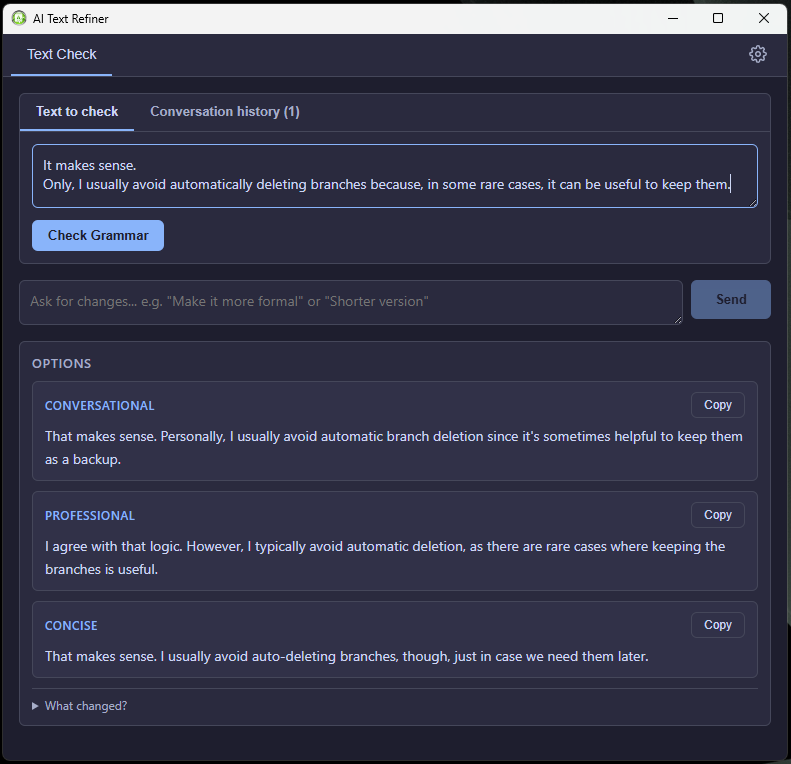
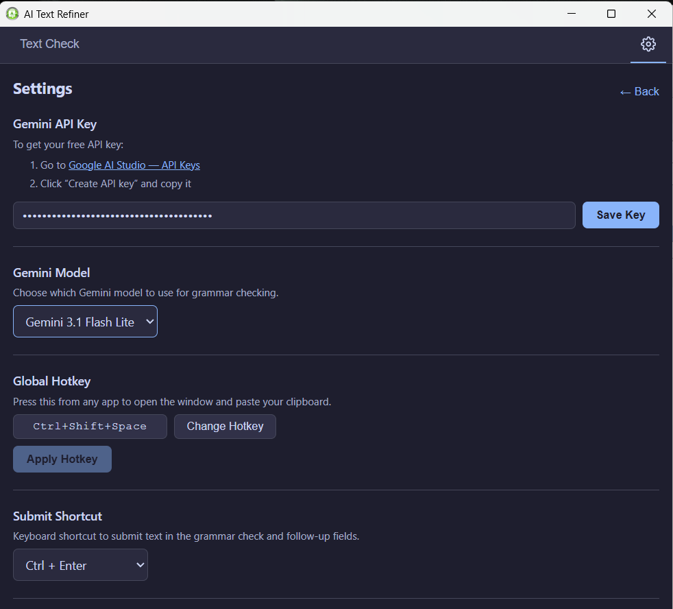
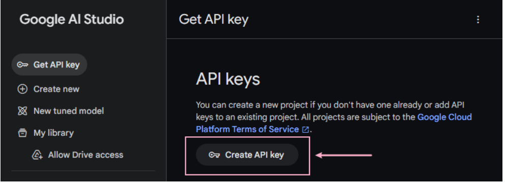

# AI Text Refiner

A lightweight Windows system tray application that can improve your text using Google Gemini AI. Copy any text, press a hotkey, and instantly get multiple improved variants — perfect for polishing workplace chat messages before sending them.

## Features

- **One-hotkey workflow** — press `Ctrl+Shift+Space` (customizable) from any app to open the refiner window with your clipboard text pre-filled
- **3 style variants** — each check returns three rewritten options (e.g. Clear, Professional, Concise) so you can pick the tone that fits
- **Follow-up refinements** — ask for further changes in a conversational style (e.g. "Make it shorter", "More casual") without starting over
- **One-click copy** — click any variant to copy it to your clipboard, ready to paste
- **Configurable Gemini model** — choose between Gemini 2.5 Flash Lite, 2.5 Flash, 2.5 Pro, 3.1 Flash Lite, and 3.1 Pro
- **Customizable hotkeys** — record a new global hotkey and a submit shortcut directly in Settings
- **System tray app** — runs quietly in the background, no taskbar clutter

## Prerequisites

To use this app you need a Google Gemini API key. The free tier is generous and more than enough for personal use.

### How to get your free Gemini API key

1. Go to [Google AI Studio](https://aistudio.google.com/apikey).
2. Sign in with your Google account (any Gmail account works)
3. Click the **"Create API key"** button
4. Select an existing Google Cloud project, or let it create one for you automatically
5. Your API key will be displayed — copy it
6. Open **AI Text Refiner → Settings** and paste the key into the API Key field, then click **Save Key**

### Free tier limits

Google provides a free tier for the Gemini API that includes:

- **Gemini 2.5 Flash / Flash Lite** — free with rate limits (sufficient for typical personal use)
- **Gemini 2.5 Pro** — limited free requests per day
- **Gemini 3.1 Flash Lite** — recommended, free with generous rate limits

No billing account or credit card is required for the free tier. You can check your current usage and limits in the [Google AI Studio console](https://aistudio.google.com/).

## Usage

1. Launch the app — it appears as an icon in the system tray
2. Copy any text to your clipboard (`Ctrl+C`)
3. Press `Ctrl+Shift+Space` (or your custom hotkey) — the app window opens with your clipboard text already loaded
4. Press `Ctrl+Enter` to refine — you'll get three improved variants
5. Not happy with the results? Type feedback in the "Ask for changes…" field (e.g. "Make it shorter", "More formal") and submit again. Repeat until you're satisfied
   **Tip:** Use the History tab to review your previous refinement requests.
6. Click any variant to copy it to your clipboard
7. Press `Escape` or click away to hide the window

## Tech Stack

- **Electron** — desktop shell
- **React** — UI
- **TypeScript** — type safety across main and renderer processes
- **electron-vite** — fast build tooling
- **Google Gemini API** (`@google/genai`) — AI-powered text refinement
- **electron-store** — persistent settings storage
